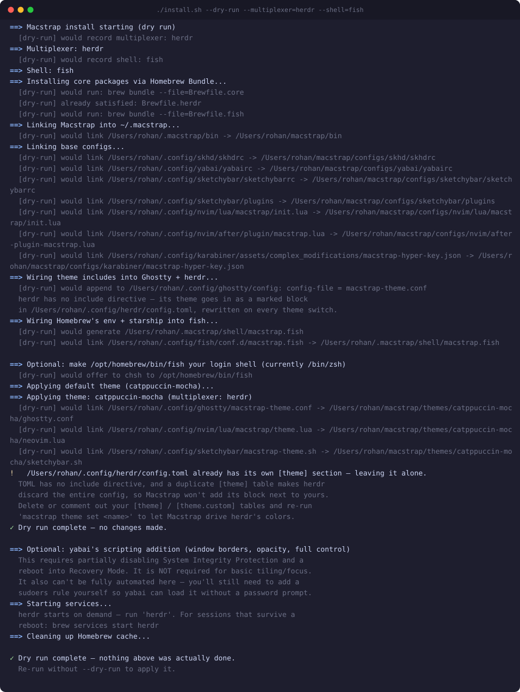
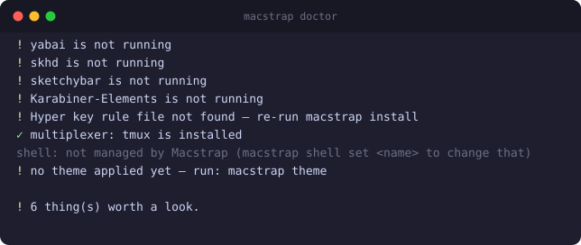
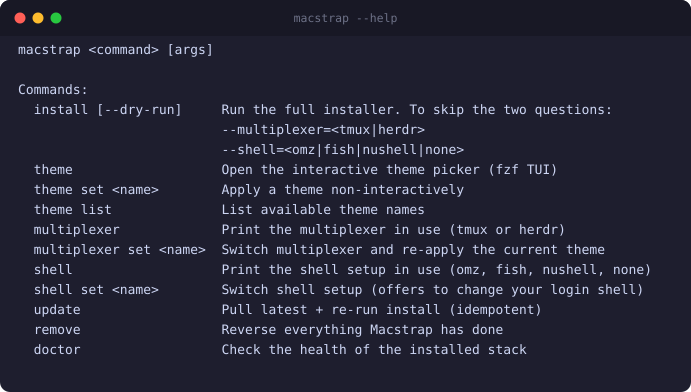
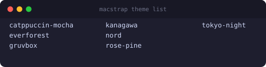

# Macstrap

A single script that sets up a curated macOS dev environment — window
manager, launcher, terminal, shell, editor — and lets you switch color themes
across all of it from one command.

Inspired by [Omarchy](https://learn.omacom.io)'s "one script, fully themed
machine" idea for Linux/Hyprland, rebuilt around what actually works on
macOS.

```sh
git clone https://github.com/rohankewal/macstrap.git ~/macstrap
cd ~/macstrap
./install.sh --dry-run    # see every change first
./install.sh              # then do it
```

---

## Should you use this?

**Macstrap is for you if** you're setting up a new Mac (or want to
re-standardize an old one), you like tiling window managers and terminal-first
workflows, and you want one command to re-theme everything instead of editing
six config files whenever you get bored of your colors.

**Skip it if** any of these are true:

- **You don't want a tiling window manager.** yabai and skhd are the core of
  this, not optional extras. If you're happy with macOS window management,
  most of the value here isn't for you.
- **You have a dotfiles setup you like.** Macstrap wants to own a specific
  slice of your config. It's careful about it (see [Safety
  model](#safety-model)), but there's no point fighting a setup that already
  works.
- **You need this to be reproducible across machines today.** There's no
  secrets management, no per-machine profiles, no CI. It's a personal-machine
  bootstrapper.
- **You can't restart your machine or touch SIP.** The full yabai experience
  (window borders, opacity) needs a partial SIP disable. Everything else works
  without it, but you should know that going in.

**When to run it:** on a fresh Mac, ideally before you've customized much —
Macstrap backs up anything it displaces, but a clean machine means fewer
surprises. Re-running it later is always safe; it's idempotent by design.

## Requirements

| | |
| --- | --- |
| OS | macOS. `install.sh` refuses to run anywhere else. |
| Chip | Apple Silicon or Intel — the Homebrew prefix is detected, not hardcoded. |
| Homebrew | If missing, the installer offers to run the official install script. |

You'll also need to be comfortable granting Accessibility permissions to yabai
and skhd — macOS will prompt, and they can't control windows without it.

---

## Installing

### 1. Clone it somewhere permanent

```sh
git clone https://github.com/rohankewal/macstrap.git ~/macstrap
cd ~/macstrap
```

> **This directory has to stay put.** Macstrap works by symlinking into it —
> `~/.macstrap/bin` points at `bin/`, and every active theme file points into
> `themes/`. Move or delete the clone and your configs break. `~/macstrap` or
> `~/.config/macstrap` are both fine; Downloads is not.
>
> If you do move it, it's recoverable and not silent: `macstrap doctor` lists
> every symlink that no longer resolves, and re-running `./install.sh` from the
> new location re-points all of them.

### 2. Preview everything

```sh
./install.sh --dry-run
```

Prints every symlink, appended line, and package it *would* touch, and changes
nothing. Worth reading once so nothing below is a surprise.



That's a real dry run, not a mock-up — the images in this README are rendered
from actual captured output by `scripts/gen-screenshots.sh`. A dry run creates
no files at all, not even `~/.macstrap`.

### 3. Run it

```sh
./install.sh
```

You'll be asked two questions up front. Both are remembered, both are
changeable later, and both can be skipped:

```sh
./install.sh --multiplexer=herdr --shell=fish
```

| Question | Options | Default if you just hit enter |
| --- | --- | --- |
| Multiplexer | `tmux`, `herdr` | `tmux` |
| Shell | `omz`, `fish`, `nushell`, `none` | `omz` |

Non-interactive runs (piped stdin, CI) default to `tmux` and `none` — the
choices that install the least and touch nothing personal.

Then it works through, in order:

1. **Homebrew** — installs it if missing (asks first).
2. **Packages** — `brew/Brewfile.core`, plus a Brewfile for each of your two
   choices. Only what you picked gets installed.
3. **Oh My Zsh** — if you chose it. Asks before running its installer, and
   passes `--unattended --keep-zshrc` so it won't change your login shell or
   replace an existing `~/.zshrc`.
4. **`~/.macstrap`** — the stable path everything else points at.
5. **Base configs** — symlinks for yabai, skhd, sketchybar, Neovim, Karabiner.
6. **Theme includes** — one line into Ghostty's config and your multiplexer's.
7. **Shell wiring** — Homebrew's env, the starship prompt, and `macstrap` on
   your `PATH`.
8. **A default theme** — `catppuccin-mocha`, so nothing is unstyled on first
   launch.
9. **yabai's scripting addition** — *prints instructions only*, never runs.
10. **Services** — starts yabai, skhd, sketchybar.

### 4. Do the two things a script can't

**Enable the Hyper key** (required — every keybinding depends on it):

> Karabiner-Elements → Complex Modifications → Add rule → enable
> **"Macstrap Hyper Key"**

Karabiner's config isn't safe to script-edit, so this one click is yours. It
remaps Caps Lock to `cmd+alt+ctrl+shift`.

**Open a new terminal window.** Shell changes only apply to new sessions.

If you picked `none` for the shell, add this to your shell config yourself, or
the `macstrap` command won't be found:

```sh
export PATH="$HOME/.macstrap/bin:$PATH"
```

### 5. Check it worked

```sh
macstrap doctor
```

Verifies services are running, the Hyper key rule is installed, your
multiplexer and shell are wired, and a theme is applied. It exits with the
number of problems it found, so it's safe to use in a script.



That capture is deliberately from a machine where nothing has been installed
yet — which is what makes it useful. Every warning names the command that
fixes it, and the exit code is the count.

### 6. Optional: yabai's scripting addition

Window borders, opacity, and full window control need a partial SIP disable
and a sudoers entry. Tiling and focus work fine without it. `install.sh` prints
the exact steps after an explicit confirmation — it never runs them, because
it's the one action here Macstrap can't cleanly reverse.

---

## Using it day to day

### Commands

```
macstrap install [--dry-run]   run/re-run the installer
                               --multiplexer=<tmux|herdr>
                               --shell=<omz|fish|nushell|none>
macstrap theme                 interactive theme picker (fzf + live preview)
macstrap theme set <name>      apply a theme directly
macstrap theme list            list available themes
macstrap multiplexer           print the multiplexer in use
macstrap multiplexer set <n>   switch to tmux or herdr, re-theming as it goes
macstrap shell                 print the shell setup in use
macstrap shell set <name>      switch shell setup (offers to chsh)
macstrap doctor                health check
macstrap update                git pull + re-run install
macstrap remove                reverse everything Macstrap has done
```



Every command that changes state accepts `--dry-run`.

### Keybindings

Everything is on **Hyper** — Caps Lock, remapped to all four modifiers at
once. Nothing is bound to plain Cmd, because every app on macOS already claims
those.

| Keys | Does |
| --- | --- |
| `Hyper` + `Return` | Ghostty |
| `Hyper` + `B` / `E` / `F` | Firefox / VS Code / Finder |
| `Hyper` + `Space` | Raycast |
| `Hyper` + `T` | Theme picker |
| `Hyper` + `H` `J` `K` `L` | Focus window left/down/up/right |
| `Hyper` + `Shift` + `H` `J` `K` `L` | Swap window in that direction |
| `Hyper` + `G` | Toggle float |
| `Hyper` + `M` | Toggle fullscreen zoom |
| `Hyper` + `1`–`4` | Switch to space 1–4 |

Edit `configs/skhd/skhdrc` to change any of it — it's a symlink, so edits take
effect on save with no reinstall.

### Switching themes

```sh
macstrap theme              # fzf picker with live color swatches
macstrap theme set nord     # or straight to it
```

Applies across Ghostty, your multiplexer, sketchybar, and Neovim at once.
tmux/herdr and sketchybar reload instantly; Ghostty picks it up in new panes;
Neovim needs a restart (or `:luafile ~/.config/nvim/lua/macstrap/init.lua`).

---

## What gets installed

Intentionally small (`brew/Brewfile.core`) — anything heavier is a manual
`brew install` away, never bundled:

- **Window management** — yabai, skhd, Karabiner-Elements
- **Bar / launcher** — sketchybar, Raycast
- **Terminal stack** — Ghostty, Neovim, starship, fzf, jq, bat, btop
- **Multiplexer** — tmux *or* herdr, only the one you pick
- **Shell** — Oh My Zsh, fish, or Nushell, only if you pick one
- **GUI apps** — Firefox, Visual Studio Code
- **Fonts** — Hack Nerd Font (sketchybar needs the glyphs)
- **Wallpaper plumbing** — desktoppr

---

## Themes

Seven ship today: `catppuccin-mocha`, `nord`, `gruvbox`, `tokyo-night`,
`rose-pine`, `kanagawa`, `everforest` — the ones with mature ports across this
whole toolchain. Omarchy's more original themes (lumon, hackerman,
matte-black) are a deliberate fast-follow: those need palettes extracted from
Omarchy's own theme files rather than vendored from an existing ecosystem.



### Adding your own

One file per theme is hand-written; everything else is generated.

```sh
mkdir themes/my-theme
$EDITOR themes/my-theme/palette.json
./scripts/gen-theme-configs.sh
macstrap theme set my-theme
```

`palette.json` needs these keys:

```json
{
  "name": "My Theme",
  "variant": "dark",
  "bg": "#1e1e2e", "bg_alt": "#181825",
  "fg": "#cdd6f4", "fg_muted": "#a6adc8",
  "black": "#45475a", "red": "#f38ba8", "green": "#a6e3a1",
  "yellow": "#f9e2af", "blue": "#89b4fa", "magenta": "#cba6f7",
  "cyan": "#94e2d5", "white": "#bac2de",
  "accent": "#cba6f7",
  "herdr_base": "catppuccin"
}
```

`herdr_base` is optional and only matters if you use herdr (see below); it
defaults to `terminal`. The generator writes `ghostty.conf`, `tmux.conf`,
`herdr.toml`, `neovim.lua`, `sketchybar.sh`, and `preview.ansi` from it —
**never hand-edit those**, they're overwritten on every run.

Wallpapers are deliberately absent: Omarchy's are real photography with named
Unsplash attributions, and redistributing them needs a per-image license check
that hasn't been done.

---

## Multiplexer: tmux or herdr

- **tmux** — the classic. Themed with one `source-file` line in `~/.tmux.conf`
  pointing at a symlink Macstrap re-points on every theme switch.
- **[herdr](https://herdr.dev)** — a newer multiplexer built around coding
  agents: tmux-style prefix keys plus mouse, panes that show whether each
  agent is working/blocked/done, sessions that survive detach and restart.

```sh
macstrap multiplexer            # print the current choice
macstrap multiplexer set herdr  # switch, re-theme, stop managing the old one
```

Recorded in `~/.macstrap/multiplexer`. Installs predating this option keep
tmux.

**Two things to know about herdr.** Its config is a single TOML file with no
include directive, so instead of a symlink the theme goes in as a marked block
(`# >>> macstrap theme` … `# <<< macstrap theme`), rewritten on every theme
switch and removed if you switch away. And if that config already has its own
`[theme]` table, Macstrap **won't touch it at all** — a duplicate TOML table
makes herdr discard the entire config, so you'll get a message asking you to
remove yours first.

herdr also exposes a fixed set of overridable color tokens rather than a full
palette, so each theme names the closest herdr built-in as its base
(`herdr_base`) and overrides tokens on top. Everforest has no herdr port, so it
bases on herdr's `terminal` theme and inherits the Ghostty palette Macstrap
already sets.

---

## Shell: Oh My Zsh, fish, Nushell — or none

- **omz** — [Oh My Zsh](https://ohmyz.sh) on the zsh macOS already gave you.
  Not a Homebrew package, so it's installed by its own script, and Macstrap
  asks first.
- **fish** — [fish](https://fishshell.com), via `brew/Brewfile.fish`.
- **nushell** — [Nushell](https://www.nushell.sh), via `brew/Brewfile.nushell`.
- **none** — your shell is untouched. The default for non-interactive installs
  and for anyone who installed Macstrap before this option existed.

```sh
macstrap shell             # print the current choice
macstrap shell set fish    # switch; unhooks the old one first
```

Whichever you pick gets the same three things: Homebrew's environment, the
**starship** prompt, and `~/.macstrap/bin` on `PATH` so the `macstrap` command
resolves. Recorded in `~/.macstrap/shell-choice`.

### How each one gets hooked up

Macstrap generates one fragment per shell into `~/.macstrap/shell/` —
generated rather than kept in `configs/` because they bake in this machine's
Homebrew prefix and starship's own init output. Delivery uses whatever
mechanism the shell actually offers:

| Shell | Hook |
| --- | --- |
| omz | one `source` line appended to `~/.zshrc` |
| fish | a symlink into fish's `conf.d/` drop-in directory |
| nushell | a marked block in `config.nu` |

Nushell gets the block treatment for the same reason herdr does: its `source`
needs a literal path resolvable at parse time, and which autoload directories
exist varies by version, so `config.nu` is the one place guaranteed to be
read. Macstrap asks `nu` itself where that file lives rather than guessing —
on macOS it's under `~/Library/Application Support`, not `~/.config`.

The zsh fragment sources Oh My Zsh only if your own `~/.zshrc` hasn't already
done so, so a pre-existing config keeps working and never loads it twice. It
sets `ZSH_THEME=""`, since starship draws the prompt.

### Changing your login shell

Separate, explicit, and always confirmed — installing a shell and living in it
are two different decisions. `chsh` only accepts shells listed in
`/etc/shells`, and adding a line there needs sudo: the one privileged step in
this feature. Macstrap asks before doing either, prints the two commands to
run yourself if you decline, and records your previous shell so `macstrap
remove` puts it back.

---

## Updating

```sh
macstrap update    # git pull --ff-only, then re-run install.sh
```

Idempotent: already-correct state is a no-op, and your theme, multiplexer, and
shell choices are preserved. If you've committed local changes, `--ff-only`
will refuse rather than create a merge you didn't ask for — pull it yourself
in that case.

## Uninstalling

```sh
macstrap remove
```

Walks the manifest backwards, restoring every backup and undoing every symlink
and appended line — including your login shell if you let Macstrap change it.
It asks for confirmation first.

Four things it deliberately leaves to you, and prints as reminders:

- `brew bundle cleanup --file=brew/Brewfile.core --force` to remove packages
- Disabling the Hyper key rule in Karabiner's UI
- `uninstall_oh_my_zsh`, if you installed Oh My Zsh
- Removing a shell you added to `/etc/shells` (needs sudo), and re-enabling SIP
  if you disabled it for yabai — that one needs Recovery Mode

## Troubleshooting

| Symptom | Likely cause |
| --- | --- |
| `macstrap: command not found` | New terminal not opened yet, or you picked `shell=none` — add `~/.macstrap/bin` to `PATH`. |
| No keybindings work | The Hyper key rule isn't enabled in Karabiner. `macstrap doctor` checks the file exists but can't see whether it's toggled on. |
| Windows don't tile | yabai/skhd lack Accessibility permission (System Settings → Privacy & Security), or aren't running — `macstrap doctor` will say. |
| No window borders/opacity | Expected without the scripting addition. `yabai --check-sa` confirms. |
| Theme applied but Ghostty unchanged | Existing panes don't restyle; open a new one, or `Cmd+Shift+,` to reload. |
| Theme applied but Neovim unchanged | Restart it, or `:luafile ~/.config/nvim/lua/macstrap/init.lua`. |
| herdr colors didn't change | Your `config.toml` probably has its own `[theme]` table — Macstrap skips it on purpose and says so. |
| Themes silently stopped applying | Usually a moved clone — the symlinks now dangle. `macstrap doctor` names every broken one. |
| Everything broke after moving the repo | Re-run `./install.sh` from the new location; it re-points every symlink, including the active theme's. Moving the clone back works too. |

Start with `macstrap doctor` — it catches most of the above.

---

## Safety model

Every state-changing action goes through `bin/lib/manifest.sh`, which logs it
to `~/.macstrap/state.jsonl`. That's what makes these true:

- **Idempotent** — re-running anything is safe; already-correct state is a
  no-op.
- **Non-destructive** — if a target already holds a real file (not our
  symlink), it's backed up to `~/.macstrap/backups/` first, never overwritten
  in place.
- **Dry-run** — `--dry-run` prints every action without doing it, and without
  creating so much as an empty file.
- **Reversible** — `macstrap remove` walks the manifest backwards and restores
  exactly what was backed up.

One deliberate exception: yabai's scripting addition needs a partial SIP
disable and a sudoers entry. It's never run automatically — `install.sh` only
prints the instructions, because it's the one action here this tool can't
cleanly reverse.

## How it's laid out

```
install.sh              the installer; every step is numbered and commented
bin/macstrap            CLI entrypoint, dispatches to the rest
bin/theme-set           applies a theme
bin/macstrap-doctor     health check
bin/macstrap-remove     manifest-driven uninstall
bin/lib/manifest.sh     the safety layer — all state changes go through here
bin/lib/multiplexer.sh  tmux/herdr choice + herdr's theme block
bin/lib/shell.sh        shell choice, fragment generation, login shell
brew/Brewfile.*         core, plus one per multiplexer and shell option
configs/                static app configs, symlinked into place
themes/<name>/          palette.json (hand-edited) + generated per-app configs
scripts/gen-theme-configs.sh   regenerates all theme output from palettes
docs/media/             the terminal images in this README
scripts/gen-screenshots.sh     regenerates them from real command output
scripts/ansi-to-svg.py         renders captured ANSI to SVG
```

The images are generated, not drawn. `gen-screenshots.sh` runs each command
for real under a PTY (so they emit their true colors), captures the output,
and renders it — every command it runs is read-only or a `--dry-run`. If the
output changes, regenerate and the diff shows it.

## Known gaps / not yet built

- **The prompt isn't themed per theme.** Every shell gets starship, but
  starship reads a single `~/.config/starship.toml` with no include directive,
  so making its colors follow `macstrap theme` needs the same managed-block
  treatment herdr and Nushell got. The prompt uses starship's defaults for now.
- Wallpaper-per-theme (blocked on the licensing check above)
- Omarchy-original themes beyond the 7 with existing ecosystem ports
- Raycast extension for the theme picker (the fzf TUI is the v1 path)
- CI (a GitHub Actions macOS runner doing `install.sh` end-to-end + shellcheck)
- Ghostty's `-e` launch flag and `config-file` include directive are written
  against current docs but not confirmed against every Ghostty release — check
  these first if the theme picker keybinding or Ghostty theming misbehaves.

## License

MIT — see [LICENSE](LICENSE).
